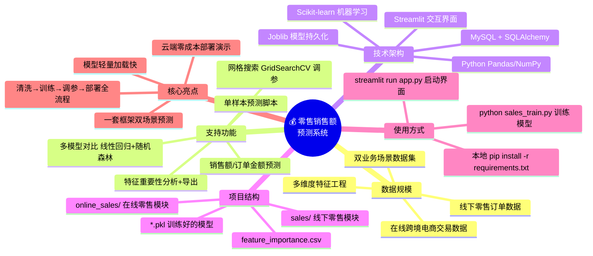

# 零售销售额预测系统（Sales-Prediction-ML）
基于机器学习的线下零售 + 在线电商双场景销售额预测分析项目
## 项目介绍
本项目基于线下零售订单数据与在线跨境电商交易数据，构建机器学习回归模型实现销售额 / 订单金额预测，包含完整的数据清洗、特征工程、多模型对比、网格搜索调参、特征重要性分析，并提供轻量化 Web 可视化交互界面，可直接部署使用。
## 项目概览


## 项目结构
```
├── online_sales/               # 在线跨境零售预测模块
│   ├── app_o.py                # 在线零售预测 Web 界面
│   ├── online_train.py         # 在线零售模型训练脚本
│   ├── online_predict.py       # 在线零售单样本预测脚本
│   ├── online_plot.py          # 在线模型特征重要性可视化
│   ├── online_sales_model.pkl  # 在线零售训练好的模型
│   ├── online_feature_importance.csv  # 在线模型特征重要性结果
│   └── export_to_csv_o.py      # 在线数据导出脚本
│
├── sales/                      # 线下零售预测模块
│   ├── app.py                  # 线下零售预测 Web 界面
│   ├── sales_train.py          # 线下零售模型训练脚本
│   ├── sales_predict.py        # 线下零售单样本预测脚本
│   ├── sales_plot.py           # 线下模型特征重要性可视化
│   ├── sales_model.pkl         # 线下零售训练好的模型
│   ├── feature_importance.csv  # 线下模型特征重要性结果
│   ├── retail_sales.csv        # 线下零售数据集
│   └── export_to_csv_s.py      # 线下数据导出脚本
│
├── README.md                   # 项目说明文档
└── requirements.txt            # 项目依赖清单
```
## 快速开始
### 1.安装依赖
```
pip install -r requirements.txt
```
### 2.训练线下零售模型
```
python sales_train.py
```
### 3.训练在线零售模型
```
python online_train.py
```
### 4.启动线下预测界面
```
streamlit run app.py
```
### 5.启动在线预测界面
```
streamlit run app_o.py
```
## 在线演示地址
- ##线下零售销售额预测：https://qky-online-sales-preonline-diction-app.streamlit.app/##
- ##在线跨境零售订单金额预测：https://qky-online-sales-preonline-diction-app.streamlit.app/##
## 模型与评估
- ##主力模型：随机森林回归器（RandomForestRegressor）##
- ##对比模型：线性回归（LinearRegression）##
- ##评估指标：R²、MAE、RMSE##
- ##支持特征重要性排序输出与分析##
## 项目亮点
- ##一套框架同时支持线下零售 + 在线电商双场景预测##
- ##数据清洗 → 特征处理 → 训练 → 调参 → 部署全流程打通##
- ##界面简洁易用，可直接演示、交付、扩展##
- ##模型轻量、加载快，适合云端部署
