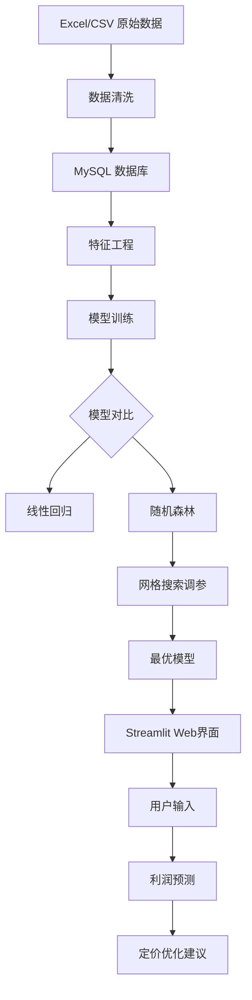

# 线下零售利润预测与折扣优化

本项目通过机器学习模型（随机森林 + 线性回归）对线下零售订单的利润进行预测，并结合折扣策略分析，提供定价优化建议。项目包含数据清洗、模型训练、特征重要性分析、Streamlit 可视化界面，支持 MySQL 数据导入与 CSV 导出。
## 项目流程图


## 项目结构
```
  ├── sales/ # 核心模块：模型训练与预测
  │ ├── app.py # Streamlit 前端交互界面
  │ ├── sales_train.py # 模型训练与评估脚本
  │ ├── export_to_csv_s.py # MySQL 数据导出为 CSV
  │ ├── sales_model.pkl # 训练好的随机森林模型
  │ ├── feature_importance.csv # 特征重要性排序
  │ ├── model_config.csv # 模型最佳参数与评估结果
  │ ├── model_metrics.xlsx # 模型指标汇总
  │ └── retail_sales.csv # 原始数据（CSV 格式）
  ├── xlsx/ # Excel 数据导入模块
  │ ├── retail_sales.py # 数据清洗并导入 MySQL
  │ ├── sample_-_superstore.xlsx # 示例数据源
  │ └── README.md
  ├── requirements.txt # Python 依赖
  └── README.md # 项目说明（本文件）
```
## 功能特点

- 利润预测：基于历史订单特征，预测单笔订单的利润
- 折扣优化：支持用户输入折扣比例，动态计算毛利率与预测利润
- 定价合理性分析：对比数学模型利润与模型预测利润，给出调价建议
- 地区推荐：自动计算并提示最优销售地区
- 模型对比：同时支持线性回归与随机森林，自动选择最优模型
- 特征重要性分析：输出影响利润的关键因素（如折扣、类别、地区等）
- 数据清洗与入库：支持 Excel/CSV 数据清洗并导入 MySQL

## 模型说明

- 算法：随机森林回归（RandomForestRegressor）
- 特征：
  - 数值型：Quantity、Discount、Avg_Unit_Price、Gross_Margin
  - 类别型：Category、Sub-Category、Region、Segment、Ship Mode
- 目标变量：Profit
- 预处理：
  - 数值特征：中位数填充 + 标准化
  - 类别特征：众数填充 + One-Hot 编码
- 超参数优化：GridSearchCV
- 评估指标：R²、MAE、RMSE

训练脚本会自动保存最优模型（sales_model.pkl）及特征重要性（feature_importance.csv）

## 模型效果

| 指标 | 值 |
|------|------|
| 最佳参数 | max_depth=20, n_estimators=100 |
| 交叉验证 R² | 0.8345 |
| 测试集 R² | 0.9622 |
| MAE | 7.62 |
| RMSE | 47.98 |

## 快速开始

### 1. 安装依赖

```bash
pip install -r requirements.txt
```
### 2. 运行 Streamlit 界面
```
cd sales
streamlit run app.py
```
### 3. 训练新模型（可选）
```
cd sales
python sales_train.py
```
### 4. 从 MySQL 导出数据（可选）
```
cd sales
python export_to_csv_s.py
```
### 5. 导入 Excel 数据到 MySQL（可选）
```
cd xlsx
python retail_sales.py
```
注意：MySQL 连接信息请在脚本中修改（如 export_to_csv_s.py 和 retail_sales.py）

## 界面预览
- 输入销售数量、单价、成本、折扣比例
- 选择商品类别、子类别、地区、客户类型、运输方式
- 点击"预测利润"：
- 显示数学模型利润与模型预测利润
- 给出定价合理性分析
- 推荐最优销售地区

## 依赖环境
- Python 3.8+
- pandas, numpy, scikit-learn
- streamlit, joblib
- sqlalchemy, pymysql
- matplotlib, seaborn

## 数据来源
- 示例数据：xlsx/sample_-_superstore.xlsx（Tableau 公开超市数据）
- 清洗后数据：sales/retail_sales.csv
- 数据库表：sales_data.retail_sales
